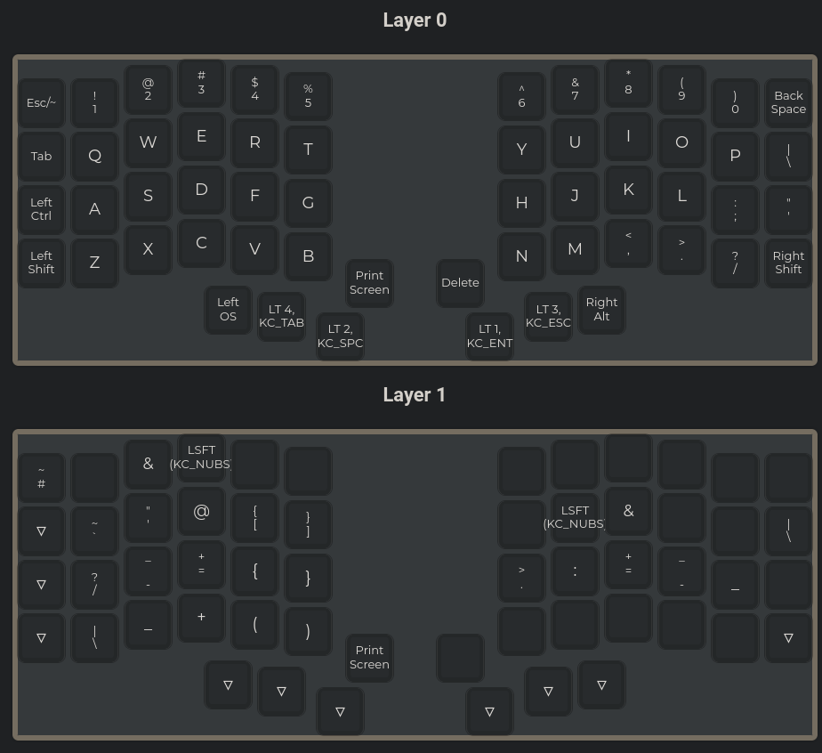
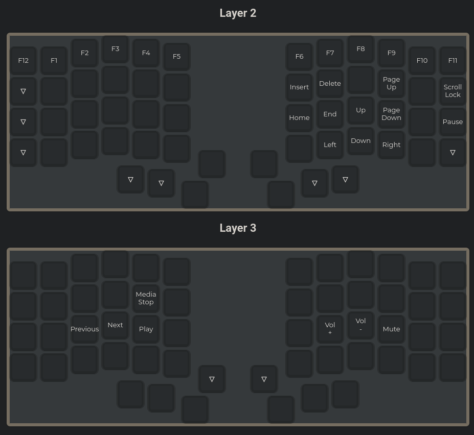
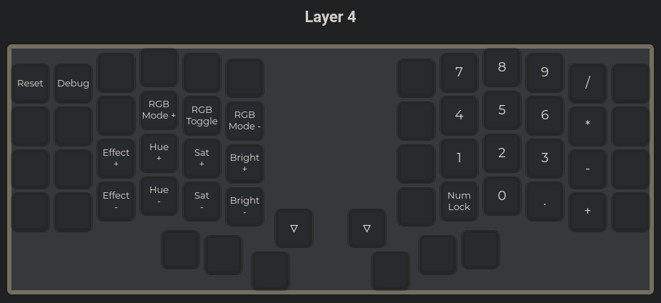

# Iris (rev4) UK Coding Layout

This is a UK coding layout for the Iris rev4 keyboard (created with the [QMK configurator](https://config.qmk.fm/#/)).

## Usage

Reset your board, then:

```bash
git clone https://github.com/liamg/iris-layout.git
cd iris-layout
make flash
```

You'll probably need to do the above as root if you have issues.

## Layers






