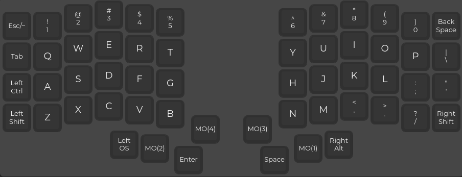
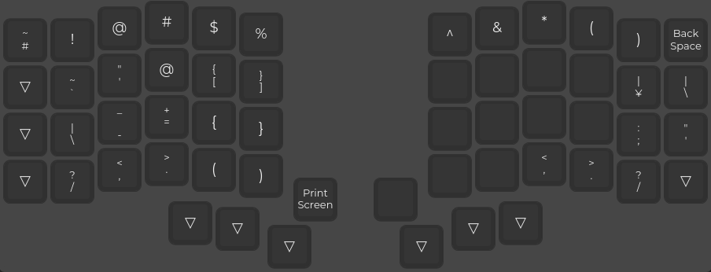
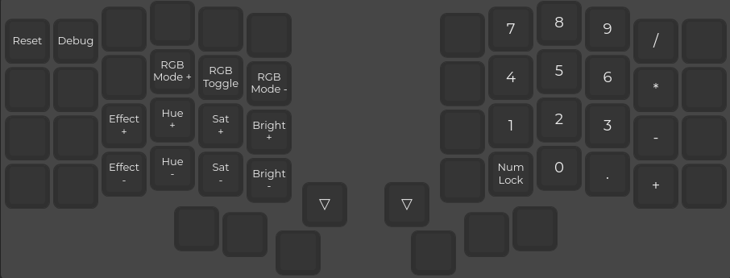

# Iris (rev4) Coding Layout

This is a coding layout for the Iris rev4 keyboard (created with the [QMK configurator](https://config.qmk.fm/#/)).

## Usage

Reset your board, then:

```bash
git clone https://github.com/liamg/iris-layout.git
cd iris-layout
make flash
```

You'll probably need to do the above as root if you have issues.

## Layers

### Layer 0: Default




### Layer 1: Symbols




### Layer 2: Navigation


### Layer 3: Media


### Layer 4: Keyboard config + numpad




